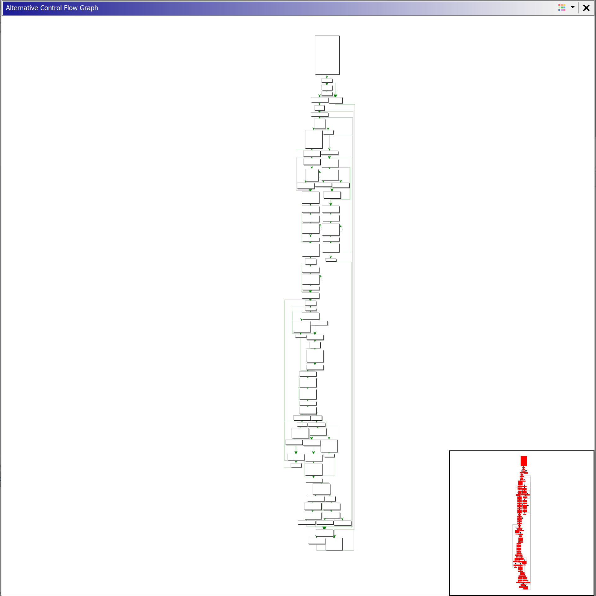
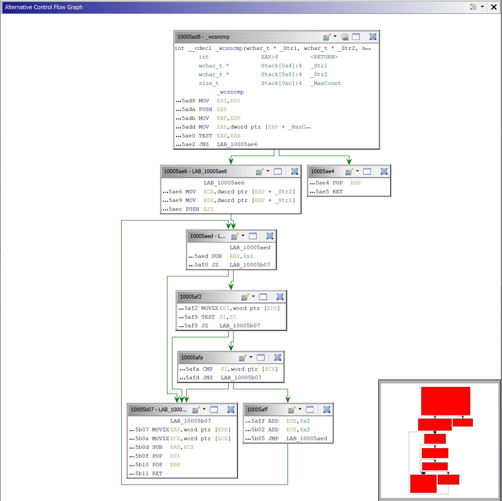

# CFGAlternative
CFGAlternative replaces the Ghidra Function Graph with another Graph that uses a different Algorithm to place the Code Blocks and route the Edges.

## Installation

Start Ghidra then click on File/Install Extension/+ and then choose the Plugin zip File. Open any project and click yes then enable the Plugin. The plugin can now be found under Window/Alternative Control Flow Graph.

## Examples 

ghidra Function Graph vs Alternative Control Flow Graph

## Inner working
The plugin uses the ghidra graph plugin and only replaces the way the Code Blocks and Edges are placed. The Plugin is mainly written in C++ that is compiled into a Binary file. When the plugin wants to display a Graph it checks if the Binary file is running if it is not running it will start it. Then it will send the size of the Code blocks and the Edges to it using a Pipe. The Program then calculates the Positions for the Blocks and the routing of the edges and sends them back to the ghidra plugin. Which displays them.

## Todo 
* The plugin currently only works on Windows
* The normal CFG in ghidra stops working if the plugin is enabled.

